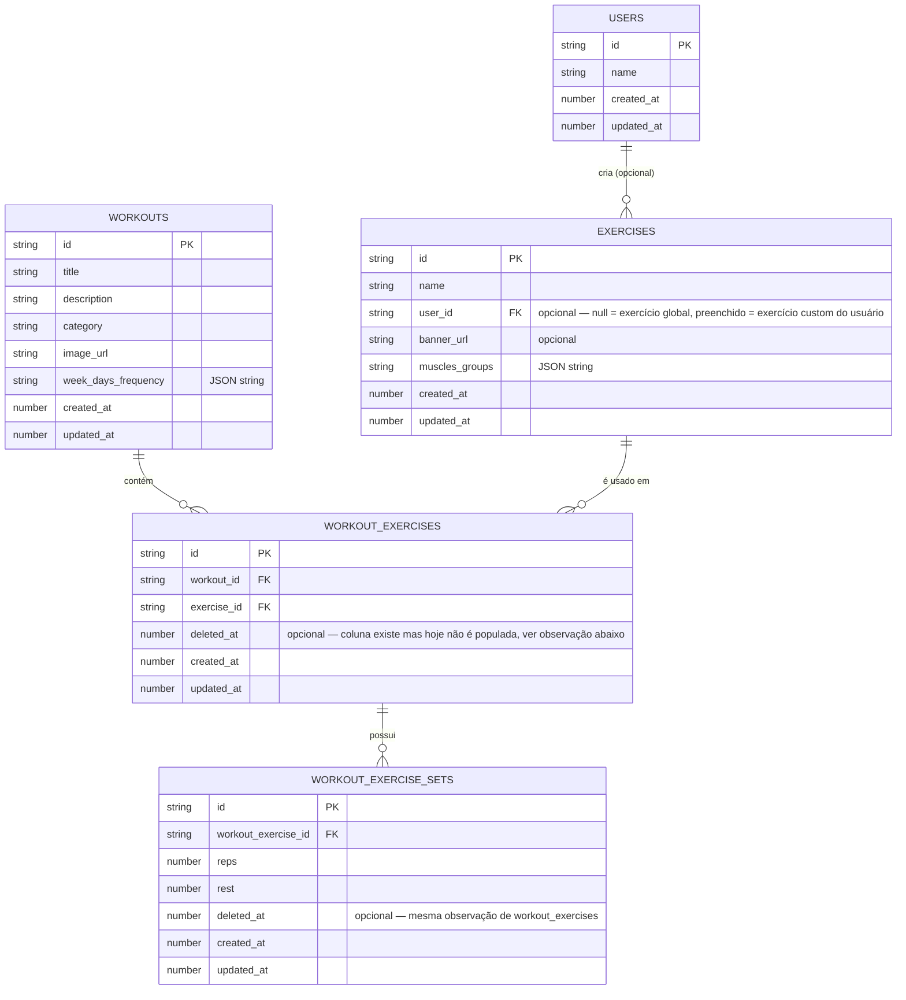

# Modelo de banco de dados (WatermelonDB)

Snapshot do schema atual em `src/infra/database/watermelon/schema.ts` (`version: 4`). Este arquivo é um retrato do estado do banco — **atualizar manualmente** sempre que uma migration mudar o schema (ver skill `create-watermelon-migration`).

## Diagrama

## Tabelas

### `users`

Model: `src/infra/database/watermelon/models/UsersModel.ts`

Usuário do app. Sem relações de saída no schema atual — é referenciado por `exercises.user_id`.

### `workouts`

Model: `src/infra/database/watermelon/models/WorkoutsModel.ts`

O treino em si — o "modelo/template" que define exercícios, séries e reps planejadas (ver [docs/brainstorms/01-workout-session-persistence.md](../brainstorms/01-workout-session-persistence.md) para a distinção entre treino planejado x execução real). Note que **não existe `user_id` em `workouts`** no schema atual — o treino não é vinculado diretamente a um usuário nesta tabela.

### `exercises`

Model: `src/infra/database/watermelon/models/ExercisesModel.ts`

Catálogo de exercícios. `user_id` é opcional: `null` representa um exercício global (vem com o app), preenchido representa um exercício customizado criado por aquele usuário.

### `workout_exercises`

Model: `src/infra/database/watermelon/models/WorkoutExercisesModel.ts`

Tabela de junção entre `workouts` e `exercises` (relação N:N) — cada linha é "este exercício faz parte deste treino". Tem `workout` e `exercise` como `@immutableRelation`.

**Observação:** existe a coluna `deleted_at` e ela é usada nas queries de listagem (`Q.where("deleted_at", null)`), mas o método de remoção (`removeExercise` em `WatermelonWorkoutExerciseRepo.ts`) hoje faz `destroyPermanently()` — delete físico. Ou seja, a coluna nunca é de fato populada; o soft-delete parece ter sido a intenção original mas ficou incompleto. Detalhado em [docs/brainstorms/01-workout-session-persistence.md](../brainstorms/01-workout-session-persistence.md).

### `workout_exercise_sets`

Model: `src/infra/database/watermelon/models/WorkoutExerciseSetsModel.ts`

Séries planejadas (`reps`, `rest`) para um exercício dentro de um treino — filho de `workout_exercises`. Mesma observação de `deleted_at` não populado.

## Fora do schema atual (planejado, não implementado)

O brainstorm em [docs/brainstorms/01-workout-session-persistence.md](../brainstorms/01-workout-session-persistence.md) desenhou duas tabelas novas para registrar a execução real de um treino (`workout_sessions` e `workout_session_sets`), separadas do modelo/template acima. Ainda não existem no `schema.ts` — não incluídas no diagrama para não confundir estado atual com estado planejado.
